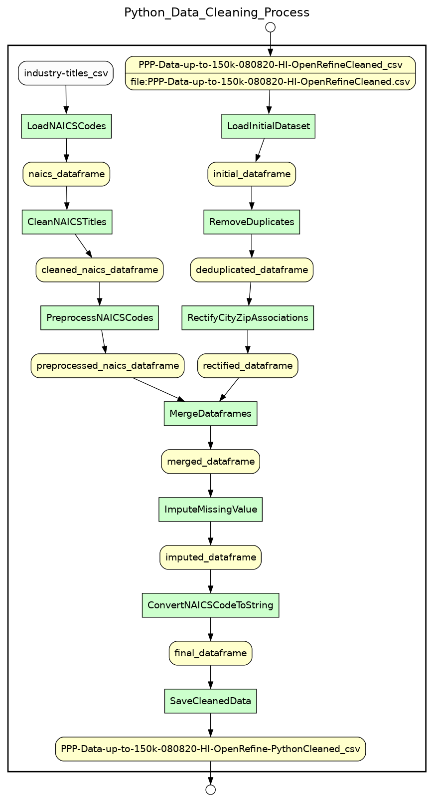

# Paycheck Protection Program (PPP) Data Cleaning Project

## Overview

This project aims to clean and analyze the **[Paycheck Protection Program (PPP) dataset](data/initial/PPP Data up to 150k 080820 HI.csv)**, with the primary use case being to
identify the cities that received the highest total amount in PPP loans. The data cleaning process was executed in
multiple steps using tools like OpenRefine, Python, and SQLite, improving the data quality and ensuring its
suitability for analysis.

---

## Project Structure

```bash
.
├── .gitignore
├── data
│ ├── initial
│ │ └── PPP Data up to 150k 080820 HI.csv
│ ├── cleaned
│ │ ├── PPP-Data-up-to-150k-080820-HI-OpenRefineCleaned.csv
│ │ └── PPP-Data-up-to-150k-080820-HI-OpenRefine-PythonCleaned.csv
│ ├── external
│ │ └── industry-titles.csv
│ ├── database
│ │ └── PPP.db
│ └── openrefine_projects
│ │ └──  PPP-Data-up-to-150k-080820-HI-csv.openrefine.tar.gz
│ │ └──  PPP-OpenRefine-Operations-History.json
│ └── DataLinks.txt
├── scripts
│ ├── notebooks
│ │ ├── clean_PPP_dataset.ipynb
│ │ ├── domain_constraint_checks.ipynb
│ │ └── load_PPP_data_into_db.ipynb
│ ├── python_scripts
│ │ └── main_use_case_u1_visualization.py
│ └── yesworkflow_scripts
│ ├── YW_clean_ppp_dataset.py
│ ├── YW_load_data_into_db.py
│ └── YW_outer_workflow_PPP_data_cleaning_process.py
├── images
│ ├── YW_clean_PPP_dataset_diagram.png
│ ├── YW_load_data_into_db_diagram.png
│ ├── YW_OpenRefine_operations_diagram.png
│ └── top_10_cities_by_total_ppp_loan_amount.png
├── CS513_Data_Cleaning_Final_Project_Phase-1_Report.pdf
├── CS513_Data_Cleaning_Final_Project_Phase-2_Report.pdf
├── LICENSE
├── README.md
└── requirements.txt
```

---

## Data cleaning steps

1. **[Initial Data Cleaning with OpenRefine](data/openrefine_projects/PPP-OpenRefine-Operations-History.json)**: The PPP dataset was initially cleaned using OpenRefine. This step involved
   operations like removing leading and trailing whitespaces, standardizing date formats, and handling null values.

<div align="center">
    
</div>

Due to its large size, the above YesWorkflow diagram is difficult to visualize correctly, so you can view it in a larger size in the following URL: https://raw.githubusercontent.com/gutyoh/CS513_Data_Cleaning_Final_Project/master/images/YW_OpenRefine_operations_diagram.png


2. **[Python Data Cleaning Steps](scripts/notebooks/clean_PPP_dataset.ipynb)**: The cleaned data was further processed
   using Python to remove duplicates, rectify
   city and zip code associations, and add a new column for NAICS titles.

<div align="center">
    
</div>


3. **[Domain Constraint Checks](scripts/notebooks/domain_constraint_checks.ipynb)**: Checks were performed on various columns in the dataset to ensure that the data adheres
   to the expected domain constraints.


4. **[Python Data Loading into SQLite Database Steps](scripts/notebooks/load_PPP_data_into_db.ipynb)**: The cleaned data was loaded into a SQLite database. This step
   involved creating necessary tables in the database and splitting the DataFrame into separate DataFrames for each
   table.

<div align="center">
    
</div>

5. **[Referential Integrity Checks](scripts/notebooks/referential_integrity_checks.ipynb)**: A series of referential integrity checks were performed on the SQLite database to
   ensure that all foreign key values in the Loans table corresponded to an existing primary key in the respective
   related tables.


6. **[Visualization](scripts/python_scripts/main_use_case_u1_visualization.py)**: The cleaned and processed data was visualized to identify the cities that received the highest
   total amount in PPP loans.

---

## Running the Scripts

1. Clone the project files from the GitHub repository to your local machine using the following command:

```bash
git clone https://github.com/gutyoh/CS513_Data_Cleaning_Final_Project.git
```

2. Navigate to the project directory:

```bash
cd CS513_Data_Cleaning_Final_Project
```

3. Set up a new virtual environment to manage dependencies for the project.

**Linux and macOS:**

```bash
python3 -m venv ppp_data_cleaning_venv
source ppp_data_cleaning_venv/bin/activate
```

**Windows:**

```bash
python -m venv ppp_data_cleaning_venv
ppp_data_cleaning_venv\Scripts\activate
```

4. Install all necessary dependencies using the following command:

```bash
pip install -r requirements.txt
```

5. Run the Jupyter notebooks and Python scripts in the order mentioned in the **Data cleaning steps** section above.

---

## Data cleaning results

Having completed an extensive data cleaning process, we are now ready to visualize our **“Main” use case U1: “Identify
the cities that received the highest total amount in PPP loans”**. The graph below represents a culmination of our
data-cleaning efforts, showcasing the Top 10 cities by total PPP loan amount:


Analyzing the chart, it is clear that Honolulu received the highest total loan amount, significantly outpacing all other
cities. While receiving less total loan amount than Honolulu, the remaining cities still represent significant
recipients of PPP loans.

The chart lets us quickly and intuitively understand the distribution of PPP loans among the top 10 cities. It also
emphasizes the disparities between these cities, highlighting the significant concentration of loans in Honolulu
compared to other cities.

---

## Contributions

The development of this Data Cleaning project was a collaborative effort of a team of 2 members. Each team member
contributed in various ways to the application's development, testing, and documentation.

### Team 19 — Members and Tasks

**Hermann Rosch – hrosch2@illinois.edu**:

- Performed all OpenRefine data cleaning steps, including whitespace trimming, `City` name standardization, and type
  conversion.


- Performed all Python data cleaning operations, including duplicate records removal, `City`-`Zip` code corrections
  using the `uszipcode` library, and the addition of the `NAICSTitle` column using the external `industry-titles.csv`
  dataset.


- Wrote the code for Domain Constraint checks on the
  cleaned `PPP-Data-up-to-150k-080820-HI-OpenRefine-PythonCleaned.csv` dataset using Python and `pandas`.

**Lakshmi Susheela Amrutha Pydeti – lpydeti2@illinois.edu**:

- Devised and implemented the SQLite database loading strategy, including splitting the DataFrame into separate
  DataFrames for each table, appending these DataFrames to their respective SQLite tables, and creating `'key'` columns
  for merging.


- Implemented the code to merge `ID` values into the original `df` DataFrame, the creation of the `Loans` table in the
  SQLite database, and the final commit of all changes to the SQLite database.


- Wrote the Python code using the `sqlite3` library for Referential Integrity checks on the `PPP.db` SQLite database.

___

## License

This project is licensed under the MIT License - see the [LICENSE](LICENSE) file for details.

___

## Disclaimer

This project is developed for educational purposes only and is not intended for commercial use. The authors make no
representations or warranties of any kind, express or implied, about the completeness, accuracy, reliability, or
suitability of the information, software, or components contained in this project for any purpose. Any reliance you
place on such information is strictly at your own risk. The authors will not be liable for any loss or damage arising
from the use or misuse of this project or its components.


